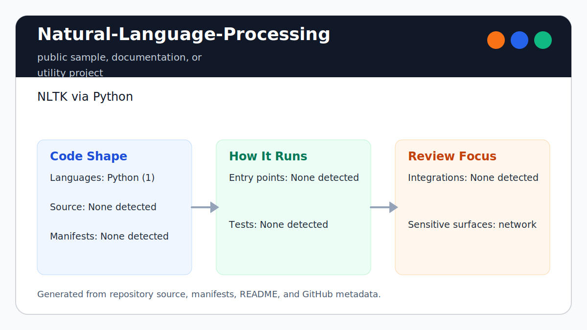

# Natural-Language-Processing

<!-- README-OVERVIEW-IMAGE -->


## Overview

`garethpaul/Natural-Language-Processing` is a public sample, documentation, or utility project. NLTK via Python

This README is based on the checked-in source, manifests, scripts, and repository metadata on the `master` branch. The project language mix found during review was: Python (1).

## Repository Contents

- `README.md` - project overview and local usage notes
- `SECURITY.md` - security reporting and disclosure guidance
- `VISION.md` - project direction and maintenance guardrails

Additional scan context:

- Source directories: no top-level source directories detected
- Dependency and build manifests: none detected
- Entry points or build surfaces: none detected
- Test-looking files: no obvious test files detected

## Getting Started

### Prerequisites

- Git
- Python 3.10 or newer
- NLTK for running the sample against the built-in stopword corpus

### Setup

```bash
git clone https://github.com/garethpaul/Natural-Language-Processing.git
cd Natural-Language-Processing
python3 -m pip install -r requirements.txt -c constraints.txt
python3 -m nltk.downloader stopwords  # optional; falls back to stop_words.txt when absent
```

The setup commands above are derived from repository files. Legacy mobile, Python, or JavaScript samples may require older SDKs or package versions than a modern workstation uses by default.

`requirements.txt` pins NLTK 3.9.4 while this repository contains its affected
resource loader. `constraints.txt` records the rest of the reviewed Python
3.10, 3.12, and 3.14 graph used by CI. These exact versions reduce resolver drift but do not
authenticate downloaded package artifacts or make installation
offline-reproducible.

The sample enables `nltk.pathsec.ENFORCE` before importing NLTK tokenizers or
corpora and replaces NLTK 3.9.4's implicit temp-directory trust with up to 64
explicit `nltk.data.path` or `NLTK_DATA` roots of at most 4,096 characters.
Filesystem roots such as `/` are rejected. User text is passed only to
`wordpunct_tokenize`; the default corpus lookup remains the fixed
`corpora/stopwords` resource. Do not add caller-controlled NLTK resource URLs.

## Running or Using the Project

- Run `python3 language_detection.py` to detect the language of the checked-in
  English sample text.
- Run `python3 language_detection.py "the quick example and you"` to classify
  your own short text.
- Import `detect_language` from `language_detection.py` for small experiments.
- Ambiguous tied stopword scores return `unknown` instead of choosing by mapping
  order.
- Near-tie stopword scores return `unknown` unless the winning language clears
  the minimum margin.
- Longer mixed-language passages return `unknown` when their leading stopword
  scores tie; a passage can still receive one language label when a single
  stopword set clears both the configured density and margin thresholds.
- Punctuation-only tokens are ignored before stopword scoring, so symbols alone
  do not create language evidence.
- Explicit empty stopword mappings stay empty and return `unknown` rather than
  falling back to the default corpus.
- Sparse stopword evidence in mostly unrelated text returns `unknown` unless the
  winning language has enough density across the unique alphabetic tokens.
- Stopword entry normalization strips and lowercases provider entries while
  ignoring blank lines before scoring.
- Text token normalization strips and lowercases tokenizer output before
  stopword scoring so padded tokens match corpus entries.
- Explicit stopword set normalization applies the same strip/lowercase rules to
  caller-provided stopword mappings before scoring.
- The stopword entry type guard ignores non-string provider and explicit values
  before normalization instead of raising or coercing them.
- Scalar stopword collections are rejected before iteration so malformed
  strings cannot become character-level language evidence.
- Mapping-shaped stopword collections are rejected before iteration so mapping
  keys cannot become stopword evidence.
- The token entry type guard ignores non-string tokenizer output before string
  normalization and scoring.
- The tokenizer output type guard treats scalar strings, bytes, and
  non-iterable return values as empty evidence instead of iterating or raising.
- Mapping-shaped tokenizer output is rejected before iteration so mapping keys
  cannot become token evidence.
- The tokenizer iteration failure guard discards partial evidence when a custom
  tokenizer raises while its returned iterator is being consumed.
- The tokenizer invocation failure guard converts custom tokenizer call errors
  to empty evidence without exposing provider diagnostics.
- Stopword iterable failures discard that language's partial normalized entries
  without exposing provider diagnostics or corrupting other language evidence.
- Stopword mapping iteration failures discard all partial language evidence
  without exposing caller diagnostics or allowing mapping order to affect output.
- The stopword provider invocation failure guard converts `fileids()` and
  `words()` errors to empty evidence while preserving missing-corpus fallback.
- Scalar provider language collections are rejected before iteration so a
  malformed `fileids()` string cannot create one-character language buckets.
- Mapping-shaped provider language collections are rejected before iteration so
  `fileids()` mapping keys cannot trigger `words()` lookups.
- Language label normalization strips and lowercases caller-provided or
  provider-loaded language names, merging duplicate normalized stopword
  mappings before scoring.
- Language label validation ignores non-string or non-alphabetic mapping keys
  so sentinel values and numeric IDs cannot become detector outputs.
- The language label control character guard ignores labels containing newline,
  terminal escape, or other non-printable characters before scoring or CLI output.
- Bounded detector text accepts at most 100,000 characters before tokenization
  and rejects invalid types without echoing private input.

## Known Accuracy Limits

This sample compares sets of unique normalized words with stopword sets. It does
not learn syntax, word order, context, dialect, or code-switching patterns, and
repeating a stopword does not increase its score. Mixed-language text receives
one label whenever a single stopword set clears the density and margin rules;
`unknown` therefore means insufficient or ambiguous heuristic evidence, not a
model-calibrated probability.

Model-based detectors can use character or token sequences and are generally a
better fit for short, informal, transliterated, or code-switched text. This
repository intentionally keeps the smaller offline stopword example and makes
no production accuracy claim.

## Testing and Verification

- `make lint`
- `make test`
- `make build`
- `make check`
- The Make gates are location-independent. From another directory, pass the
  checkout's Makefile by absolute path, such as
  `make -f /path/to/Natural-Language-Processing/Makefile check`.
- Absolute Makefile paths containing spaces, brackets, or apostrophes retain
  the complete checkout root. `ROOT` overrides are ignored, and attempts to
  override GNU Make's `MAKEFILE_LIST` metadata fail closed.
- `python3 -m unittest discover -s tests`
- `python3 scripts/check-baseline.py`
- `tests/fixtures/nltk_stopword_overlap.json` records provenance hashes and the
  exact relevant overlaps for all 33 NLTK stopword languages. Tests require
  English to lead Hinglish and every other runner-up by `MIN_STOPWORD_MARGIN`.
- Pinned `ubuntu-24.04` GitHub Actions installs `requirements.txt` through
  `constraints.txt`, runs `pip check`, and executes `make check` on Python 3.10,
  3.12, and 3.14 without private text, external service calls, or NLTK corpus
  downloads.

When the required SDK or runtime is unavailable, use static checks and source review first, then verify on a machine that has the matching platform toolchain.

## Configuration and Secrets

- No required secret or credential file was identified in the repository scan. If you add integrations later, keep secrets out of git.

## Security and Privacy Notes

- Review changes touching network requests, sockets, or service endpoints; examples from the scan include language_detection.py.

## Maintenance Notes

- The unit tests use injected stopword fixtures, including a compact
  provenance-documented 33-language overlap fixture, so they do not require
  downloading NLTK corpora.
- Use an absolute Makefile path when running the verification gates outside the
  checkout.
- If NLTK or its stopwords corpus is unavailable, the sample falls back to the
  checked-in English stop-word list and returns `unknown` for zero-score input.
- See `docs/plans/2026-06-09-ambiguous-stopword-ties.md` for the ambiguous
  stopword tie behavior.
- See `docs/plans/2026-06-09-near-tie-stopword-margin.md` for the near-tie
  stopword margin behavior.
- See `docs/plans/2026-06-09-punctuation-token-filter.md` for punctuation-only
  token filtering behavior.
- See `docs/plans/2026-06-09-empty-stopword-mapping.md` for explicit empty
  stopword mapping behavior.
- See `docs/plans/2026-06-09-sparse-stopword-density.md` for sparse stopword
  evidence handling.
- See `docs/plans/2026-06-09-stopword-entry-normalization.md` for stopword
  entry normalization behavior.
- See `docs/plans/2026-06-14-stopword-entry-type-guard.md` for stopword entry
  type validation behavior.
- See `docs/plans/2026-06-09-text-token-normalization.md` for text token
  normalization behavior.
- See `docs/plans/2026-06-09-explicit-stopword-set-normalization.md` for
  explicit stopword set normalization behavior.
- See `docs/plans/2026-06-10-stopword-language-label-normalization.md` for
  language label normalization behavior.
- See `docs/plans/2026-06-10-ci-baseline.md` for the GitHub Actions baseline.
- See `docs/plans/2026-06-10-stopword-language-label-validation.md` for
  language label validation behavior.
- See `docs/plans/2026-06-09-make-gate-aliases.md` for the local verification
  gate aliases.
- See `SECURITY.md` for vulnerability reporting and safe research guidance.
- See `VISION.md` for project direction and contribution guardrails.

## Contributing

Keep changes small and tied to the project that is already present in this repository. For code changes, document the toolchain used, avoid committing generated dependency directories or local configuration, and update this README when setup or verification steps change.
